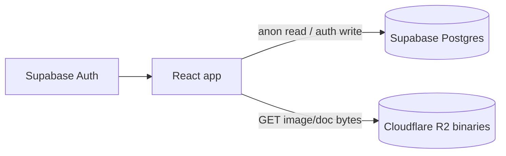

# Data architecture

Building Map Explorer stores **structured data in Supabase Postgres** and **RTU picture/document binaries on Cloudflare R2**.

## Overview



| Layer | Responsibility |
|-------|----------------|
| **Supabase** | Buildings, RTUs, tenants, utilities, polygons, RTU schedule, pricing, settings, picture/document metadata |
| **Cloudflare R2** | RTU picture and document file bytes only |
| **Cloudflare Pages** | Hosts the React app (quadreal account) |
| **GitHub** | Source history / version tracking; CI runs typecheck, lint, and tests on push |

There is **no JSON sync pipeline** and no Settings → “Sync to Cloudflare” flow. Edits made while signed in write directly to Supabase.

## Database schema

Migrations live in [`supabase/migrations/`](../supabase/migrations/).

| Table | Purpose |
|-------|---------|
| `buildings` | Building markers (+ `sold` flag) |
| `rtus` | RTU markers per building (+ `replacement_year`, `replacement_note`) |
| `tenants` | Tenant markers |
| `utilities` | Utility markers |
| `polygons` | Tenant polygons (`paths` JSONB) |
| `rtu_pricing` | Per-tonnage replacement pricing rows |
| `rtu_pictures` | Picture metadata (`file_name`, `hidden`, denormalized address/RTU name) |
| `rtu_documents` | Document metadata |
| `app_settings` | Theme, manager renames, schedule/pricing source metadata |

**RLS:** public `SELECT`; authenticated users can `INSERT`/`UPDATE`/`DELETE`.

## App data layer

Typed API modules in [`src/data/`](../src/data/):

- `portfolioApi.ts` — load/save portfolio
- `scheduleApi.ts` — RTU replacement schedule on `rtus` rows
- `pricingApi.ts` — `rtu_pricing` table
- `mediaApi.ts` — picture/document metadata
- `settingsApi.ts` — `app_settings`

React Query hooks:

- `usePortfolioData` / `useSavePortfolio`
- Zustand stores hydrate from Supabase on load (`rtuScheduleStore`, `rtuPricingStore`)

## Auth

Email/password via Supabase Auth. Sign in from **Settings → Account**.

- **Anonymous:** browse map, filters, cost estimator, Excel export
- **Authenticated:** edit markers, polygons, notes, schedule, pricing, settings; import Excel to Supabase

Env vars (see [`.env.example`](../.env.example)):

- `VITE_SUPABASE_URL`
- `VITE_SUPABASE_ANON_KEY`

## Cloudflare R2

Binary storage only:

- `VITE_RTU_PICTURES_BASE_URL` — public CDN for picture files
- `VITE_RTU_DOCUMENTS_BASE_URL` — public CDN for document files

Which files exist for each RTU is stored in Supabase (`rtu_pictures`, `rtu_documents`).

## One-time migration from legacy JSON

If you still have data in `supabase/data/*.json` and manifest files:

```powershell
# Apply new migration in Supabase SQL editor first:
# supabase/migrations/20260703000000_schedule_pricing_media.sql

# Then load JSON into Postgres (requires service role key in .env.local):
npm run migrate-json-to-supabase
```

Requires `SUPABASE_SERVICE_ROLE_KEY` in `.env.local` (server-side only).

## Deploy

- **Live app:** Cloudflare Pages via the `push-cloudflare-build` skill (`npm run deploy` on the quadreal account).
- **GitHub `main`:** version history. Pushing runs [`.github/workflows/ci.yml`](../.github/workflows/ci.yml) (typecheck, lint, test) — it does **not** publish the site.

Map data changes take effect immediately in Supabase — no separate data deploy.

## Developer runbook: schema changes

1. Add a new SQL file under `supabase/migrations/` (timestamped name).
2. Apply to remote:

   ```powershell
   # One-time: add SUPABASE_ACCESS_TOKEN + SUPABASE_DB_PASSWORD to .env.local
   npm run db:push:dry-run   # preview
   npm run db:push           # apply
   ```

   See [`supabase/README.md`](../supabase/README.md) for link/setup details.

3. Regenerate types: `npx supabase gen types typescript --project-id wyiymdtlncperqpwriuk > src/types/database.types.ts`
4. Add/adjust functions in `src/data/` and domain types in `src/types/domain.ts`.
5. Run `npm run typecheck`, `npm run test`, commit, push.

## Related docs

- [`supabase/README.md`](../supabase/README.md) — project link, migration order
- [`README.md`](../README.md) — quick start
- [`HELP.md`](../HELP.md) — day-to-day commands
